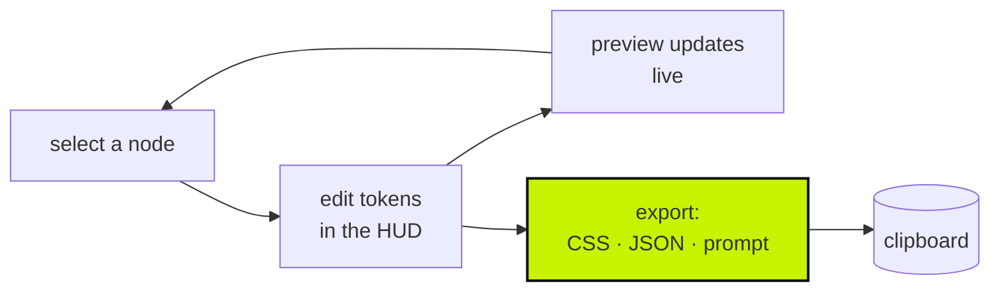
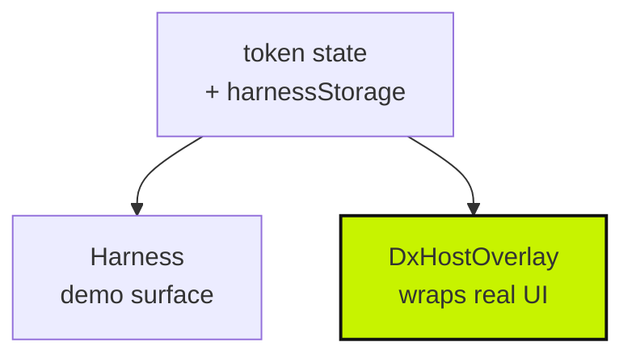

# Architecture

A design-token inspector that runs in the browser and leaves with your work. Two modes:
a standalone harness, and a drop-in overlay that wraps real host UI. MIT, no backend.

## The loop

Everything is in-browser and reversible. **The export is the product** — you leave with
CSS, JSON, or a prompt you paste somewhere else. Nothing is saved server-side because
there is no server.

## Two modes, one engine

The overlay is the interesting one: it wraps a host application's own UI rather than a
demo, which is what makes this a tool rather than a showcase. `INTEGRATION.md` is the
copy-paste setup for that.

## Stack

- React 19 + Vite + Tailwind v4, TypeScript
- `localStorage` via `harnessStorage.ts` — per-browser, never leaves the machine
- No backend, no accounts, no telemetry beyond `@vercel/analytics` on the demo

## Files

| Path | Job |
|------|-----|
| `src/App.tsx` | Harness shell — three-panel layout |
| `src/DxHostOverlay.tsx` | The drop-in. Wraps host UI rather than a demo surface |
| `src/TokenCalibrationUnit.tsx` | The HUD — editing tokens on the selected node |
| `src/GridOverlay.tsx` | Spatial grid |
| `src/LiveTokenPreview.tsx` | Preview that reflects edits immediately |
| `src/DxGridVoice.tsx` | Natural-language textarea → compiled prompt → clipboard |
| `src/tokenExport.ts` | CSS / JSON / prompt compilation |
| `src/harnessStorage.ts` | localStorage persistence |
| `src/types.ts` | `DesignNode`, `DesignProperties` |

## The rule that is not negotiable

**No in-app LLM.** `DxGridVoice` compiles a prompt and copies it. It never calls a model,
holds a key, or opens a network connection.

This is a **selling point, not an omission** — the README and a blog post both cite it as
an example of knowing when AI is the wrong tool. If a feature seems to need a model call,
that is the signal to reconsider the feature.

## The visual line

Soft Bento: 16px radius, ambient glow, deep-space canvas, dark only. **Not brutalist
CLI** — that belongs to `nil-ds` and the portfolio. Deliberately separate.

## Lineage

The matured fork of `mothership-console`. `TokenCalibrationUnit`, the grid overlay and
the `DesignNode` types exist in both; this one is ahead. Do not sync back — the console
is parked.

## Out of scope

Accounts, a backend, in-app AI, and the Cloud Run path. `Dockerfile` and `deploy.sh`
target a GCP project that was never created — `DEPLOYMENT_TODO.md` says so and
`CLAUDE.md` calls it untested. Vercel is the live deploy.

Host setup: `INTEGRATION.md`. Shipped vs planned: `PROJECT_CONTEXT.md`.
