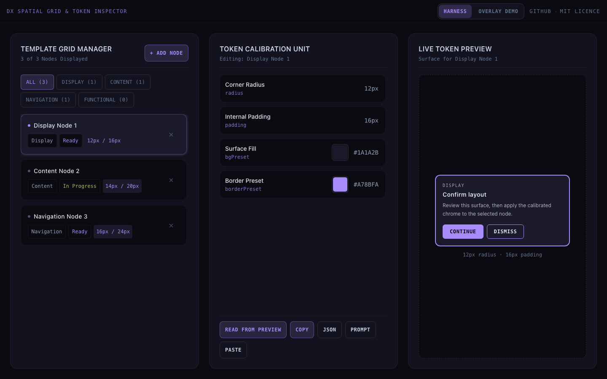
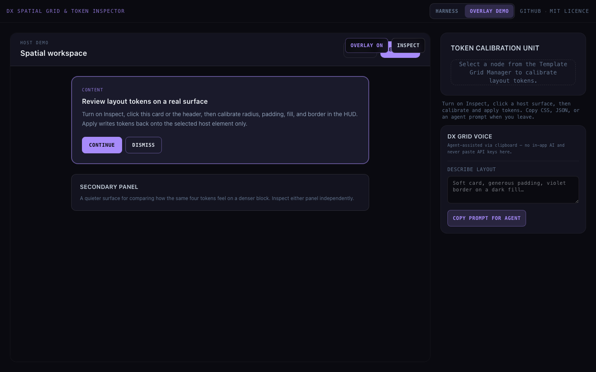

# DX Spatial Grid & Token Inspector

> A lightweight developer experience (DX) demo for React 19 and Tailwind CSS v4. Inspect design nodes, calibrate spatial tokens, wrap host UI with a local overlay, and leave with CSS, JSON, or an agent prompt — all in the browser.


**Live demo:** [dx-grid-inspector.vercel.app](https://dx-grid-inspector.vercel.app)



*Desktop view of the local test harness: filter and select layout nodes, calibrate spatial tokens, and preview the sample surface.*



*Overlay demo: wrap host UI, inspect a surface, calibrate tokens, and copy CSS / JSON / an agent prompt. Agent assistance is clipboard-only — not in-app AI.*

---

## Overview

The **DX Spatial Grid & Token Inspector** is a small, self-contained tool for exploring layout-oriented design nodes and editing spatial tokens (padding, border radius, surface colours, and border presets) on screen.

Use the **Harness** tab for the three-panel playground, or **Overlay demo** to wrap a real host surface with [`DxHostOverlay`](src/DxHostOverlay.tsx), inspect an element, apply tokens, and export.

Built as an open-source learning and portfolio project — iterating in public. Components are modular and easy to copy into your own React app; an installable npm package may come later.

---

## Features

- **Template Grid Manager:** Categorise, filter, and select layout nodes (Display, Navigation, Content, Functional). Click a status chip to toggle Ready / In Progress without changing the selected row.
- **Token Calibration Unit:** Edit corner radii, padding, surface colours, and border styles with inline validation.
- **Live Token Preview:** Sample card and button update as you calibrate radius, padding, and colours.
- **DxHostOverlay:** Drop-in wrap-around chrome for host children — enable/disable and inspect mode (Escape exits).
- **Read / apply / copy out:** Pull computed CSS into the HUD, apply tokens to a host target, or copy as CSS custom properties, JSON, or an agent prompt. Paste JSON back into the HUD.
- **DX grid voice (clipboard):** Describe a layout in natural language and copy a paste-ready agent prompt. No in-app model and never paste API keys into the demo.
- **Built-in Sanitisation:** Parses CSS layout units (`px`, `rem`, `%`, `vh`, `vw`) and validates hex / rgba colour input.
- **Local Test Shell:** [`src/App.tsx`](src/App.tsx) switches between Harness and Overlay demo modes.
- **Tailwind CSS v4 Ready:** Uses `@tailwindcss/vite` and native CSS variable architecture.
- **Strict TypeScript:** Explicit prop interfaces and a shared `DesignNode` / `DesignProperties` model in [`src/types.ts`](src/types.ts).

---

## Quick Start

### Prerequisites

- **Node.js** v18.0.0 or higher
- **npm** or **pnpm**

### Installation

1. **Clone the repository:**

   ```bash
   git clone https://github.com/JennHull-builds/dx-grid-inspector.git
   cd dx-grid-inspector
   ```

2. **Install dependencies:**

   ```bash
   npm install
   ```

3. **Start the local development server:**

   ```bash
   npm run dev
   ```

4. Open your browser at `http://localhost:5173` to view the live shell.

---

## Usage Example

### Harness panels

```tsx
import { useRef, useState } from 'react'
import { TemplateGridManager } from './GridOverlay'
import { LiveTokenPreview } from './LiveTokenPreview'
import { TokenCalibrationUnit } from './TokenCalibrationUnit'
import { readDesignPropertiesFromElement } from './tokenExport'
import type { DesignNode, DesignProperties, NodeStatus } from './types'

export default function InspectorHarness() {
  const [nodes, setNodes] = useState<DesignNode[]>([])
  const [selectedId, setSelectedId] = useState<string | null>(null)
  const previewSurfaceRef = useRef<HTMLDivElement>(null)

  const selectedNode = nodes.find((n) => n.id === selectedId) ?? null

  const previewRadius =
    selectedNode == null
      ? 12
      : typeof selectedNode.properties.radius === 'number'
        ? selectedNode.properties.radius
        : Number.parseFloat(String(selectedNode.properties.radius)) || 12
  const previewPadding =
    selectedNode == null
      ? 16
      : typeof selectedNode.properties.padding === 'number'
        ? selectedNode.properties.padding
        : Number.parseFloat(String(selectedNode.properties.padding)) || 16

  const handleUpdateProps = (id: string, newProps: DesignProperties) => {
    setNodes((prev) =>
      prev.map((node) =>
        node.id === id ? { ...node, properties: newProps } : node,
      ),
    )
  }

  const handleUpdateStatus = (id: string, status: NodeStatus) => {
    setNodes((prev) =>
      prev.map((node) => (node.id === id ? { ...node, status } : node)),
    )
  }

  const handleReadFromPreview = () => {
    const surface = previewSurfaceRef.current
    if (!selectedId || !surface) return
    handleUpdateProps(
      selectedId,
      readDesignPropertiesFromElement(surface),
    )
  }

  return (
    <div className="grid min-h-screen grid-cols-1 gap-6 bg-[#0A0A12] p-6 lg:grid-cols-3">
      <TemplateGridManager
        nodes={nodes}
        selectedNodeId={selectedId}
        onSelectNode={setSelectedId}
        onAddNode={() => {
          /* Add node logic */
        }}
        onPurgeNode={(id) =>
          setNodes((prev) => prev.filter((n) => n.id !== id))
        }
        onUpdateStatus={handleUpdateStatus}
      />
      <TokenCalibrationUnit
        selectedNode={selectedNode}
        onUpdateProperties={handleUpdateProps}
        onReadFromPreview={handleReadFromPreview}
      />
      <LiveTokenPreview
        selectedNode={selectedNode}
        previewRadius={previewRadius}
        previewPadding={previewPadding}
        surfaceRef={previewSurfaceRef}
      />
    </div>
  )
}
```

### Wrap host UI with the overlay

Copy [`DxHostOverlay`](src/DxHostOverlay.tsx) and [`tokenExport.ts`](src/tokenExport.ts) into your app (npm package still optional / later):

```tsx
import { useState } from 'react'
import { DxHostOverlay } from './DxHostOverlay'
import {
  applyDesignPropertiesToElement,
  readDesignPropertiesFromElement,
} from './tokenExport'
import type { DesignProperties } from './types'

export function OverlayExample({ children }: { children: React.ReactNode }) {
  const [inspecting, setInspecting] = useState(false)
  const [target, setTarget] = useState<HTMLElement | null>(null)
  const [tokens, setTokens] = useState<DesignProperties | null>(null)

  return (
    <DxHostOverlay
      enabled
      inspecting={inspecting}
      onInspectingChange={setInspecting}
      targetElement={target}
      onTargetSelect={(element) => {
        setTarget(element)
        setTokens(readDesignPropertiesFromElement(element))
        setInspecting(false)
      }}
    >
      {children}
    </DxHostOverlay>
  )
}
```

---

## Tech Stack

| Technology | Role |
| --- | --- |
| **React 19** | UI Library |
| **TypeScript** | Type Safety & Interfaces |
| **Tailwind CSS v4** | Utility Styling & CSS Variables |
| **Vite** | Build Tooling |
| **Vercel** | Demo Hosting |

---

## Project Structure

```text
dx-grid-inspector/
├── src/
│   ├── types.ts                   # Shared DesignNode, status, and token types
│   ├── GridOverlay.tsx            # Template grid manager
│   ├── DxHostOverlay.tsx          # Drop-in wrap-around overlay for host UI
│   ├── HostDemoSurface.tsx        # In-repo host layout for the overlay demo
│   ├── TokenCalibrationUnit.tsx   # Live spatial token calibration HUD
│   ├── LiveTokenPreview.tsx       # Sample card + button preview
│   ├── DxGridVoice.tsx            # Clipboard agent prompt (no in-app AI)
│   ├── tokenExport.ts             # Read/apply CSS; CSS/JSON/prompt formatters
│   ├── harnessStorage.ts          # localStorage snapshot for the harness
│   ├── App.tsx                    # Harness | Overlay demo shell
│   ├── main.tsx                   # Application entry point
│   └── index.css                  # Tailwind CSS v4 setup
├── docs/
│   ├── harness-screenshot.png     # Harness screenshot used in this README
│   └── overlay-screenshot.png     # Overlay demo screenshot
├── PROJECT_CONTEXT.md             # AI agent project context
├── .cursorrules                   # Code style & open-source guardrails
├── LICENSE                        # MIT
├── package.json
└── README.md
```

---

## Roadmap

Tracked as GitHub issues. Near-term:

- [x] Live token preview surface in the harness
- [x] Shared `DesignNode` types across components ([#3](https://github.com/JennHull-builds/dx-grid-inspector/issues/3))
- [x] Read live CSS from the preview into the HUD
- [x] Copy calibrated tokens as CSS / JSON
- [x] Drop-in `DxHostOverlay` demo on host UI (inspect, read, apply)
- [x] Copy agent prompt + clipboard DX grid voice
- [ ] Optional publishable npm package later ([#4](https://github.com/JennHull-builds/dx-grid-inspector/issues/4))

---

## Contributing

Contributions, issues, and feature requests are welcome. Check the [issues page](https://github.com/JennHull-builds/dx-grid-inspector/issues).

1. Fork the Project
2. Create your Feature Branch (`git checkout -b feature/AmazingFeature`)
3. Commit your Changes (`git commit -m 'Add some AmazingFeature'`)
4. Push to the Branch (`git push origin feature/AmazingFeature`)
5. Open a Pull Request

---

## License

Distributed under the MIT License. See [`LICENSE`](LICENSE) for more information.
